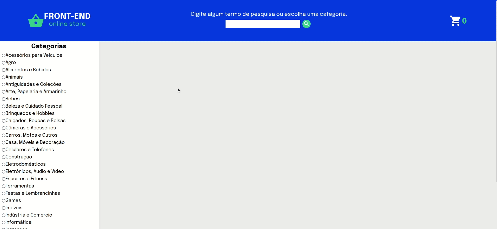

# FrontEnd Online Store
Projeto em React feito em grupo de uma versão simplificada e sem persistência no banco de dados de uma loja online. Ao utilizar essa aplicação, a pessoa usuária é capaz de buscar produtos por termos e categorias a partir da API do Mercado Livre, interagir com os produtos buscados de modo a adicioná-los e removê-los de um carrinho de compras em diferentes quantidades, visualizar detalhes e avaliações prévias de um produto, bem como criar novas avaliações, além de simular a finalização da compra dos itens selecionados.
  

## :computer: Visualize este projeto:
Acesse a página aqui:
[https://geovannaotoni-online-store.surge.sh/](https://geovannaotoni-online-store.surge.sh/)

## :bulb: Habilidades:
Feito a partir dos conhecimentos de CSS, HTML, JavaScript, JSX, React e React Router Dom, Componentes de Classe, PropTypes, NPM e Requisições via API.
